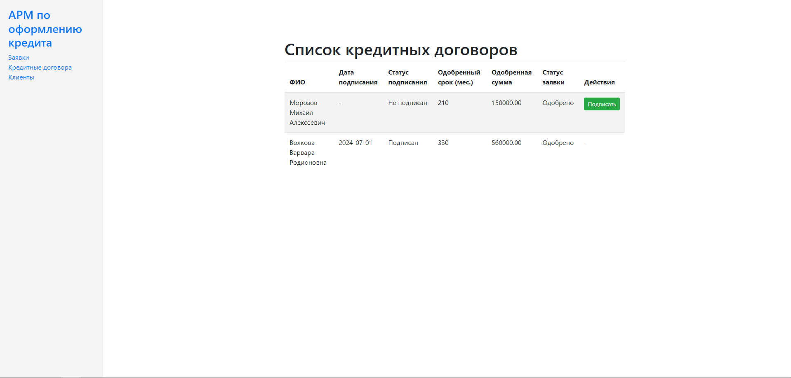

# АРМ менеджера по оформлению кредита

## Обзор

Это приложение предназначено для автоматизации рабочего места менеджера по оформлению кредита с использованием
следующего стека технологий: Spring MVC, Hibernate (без использования Spring Data) и PostgreSQL.

## Общий процесс

1. **Оформление заявки на кредит**
2. **Принятие решения по кредиту**
3. **Подписание кредитного договора**

### 1. Оформление заявки на кредит

Пользователь создает заявку на кредит, содержащую следующую информацию о клиенте:

- Фамилия, имя, отчество
- Паспортные данные
- Семейное положение
- Адрес прописки
- Контактный телефон
- Сведения о занятости (период работы, должность, название организации)
- Сумма желаемого кредита

### 2. Принятие решения по кредиту

После оформления заявки на кредит система случайным образом принимает решение о кредите. Решение состоит из статуса (
одобрен/не одобрен), предлагаемого срока в днях (1-12 месяцев), одобренной суммы кредита.

### 3. Подписание кредитного договора

После одобрения кредита система должна позволить подписать кредитный договор. Кредитный договор должен содержать
информацию из заявки, дату подписания, а также статус подписи (подписан/не подписан).

## Дополнительный функционал

1. Вывод списка всех клиентов
2. Поиск клиента по телефону, ФИО и паспортным данным
3. Вывод списка заявок со статусом одобрения
4. Вывод списка всех подписанных кредитных договоров со статусом подписания

## Структура проекта и настройка

### Схема БД

### Основной функционал

1. **Вывод списка всех клиентов**
2. **Поиск клиента по телефону, ФИО и паспортным данным**
3. **Вывод списка заявок со статусом одобрения**
4. **Вывод списка всех подписанных кредитных договоров со статусом подписания**

#### Главная страница

#### Форма оформления заявки на кредит

#### Результаты оформления заявки

##### Заявка не одобрена

##### Заявка одобрена

#### Список всех заявок

#### Список всех договоров с возможностью подписания

#### Список клиентов

#### Поиск клиента по ФИО

#### Поиск клиента по паспортным данным

#### Поиск клиента по номеру телефона

## Используемые технологии

 

